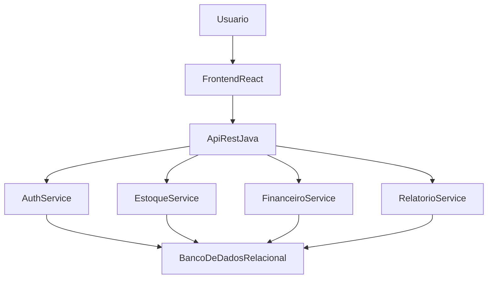

# PRD - Sistema de Controle de Estoque e Contabilidade

## 1. Visão Geral do Produto

### 1.1 Nome provisório
`GestorPyME`

### 1.2 Resumo
O `GestorPyME` é um sistema web para pequenas e médias empresas voltado ao controle de estoque e ao acompanhamento financeiro básico. A solução busca reduzir erros operacionais, centralizar informações e apoiar a tomada de decisão em negócios que muitas vezes dependem de poucos colaboradores e de processos manuais.

### 1.3 Proposta de valor
Oferecer uma plataforma simples de usar, com baixo atrito de aprendizado, que conecte o controle de produtos com contas a pagar, contas a receber e fluxo de caixa, permitindo que gestores tenham mais previsibilidade e organização sem depender apenas de planilhas ou anotações manuais.

## 2. Problema e Contexto

### 2.1 Problema central
Pequenas e médias empresas frequentemente enfrentam dificuldades para manter o controle de estoque e da movimentação financeira de forma integrada. Em muitos casos, os registros são feitos em planilhas, cadernos ou sistemas dispersos, o que gera:

- divergência entre estoque real e estoque registrado;
- perda de produtos por falta de controle de entrada e saída;
- atrasos ou esquecimentos em pagamentos e recebimentos;
- baixa visibilidade do fluxo de caixa;
- retrabalho operacional;
- dependência de poucas pessoas com conhecimento do processo.

### 2.2 Relação com a ODS 8
O projeto se conecta à `ODS 8 - Trabalho Decente e Crescimento Econômico` porque propõe uma solução que:

- melhora a produtividade operacional;
- reduz falhas em processos internos;
- fortalece a gestão de pequenos negócios;
- contribui para a formalização e organização da operação;
- apoia a sustentabilidade econômica da empresa com melhor controle financeiro.

### 2.3 Inovação proposta
A inovação do projeto está na criação de uma solução acadêmica integrada e acessível, pensada para empresas com baixa maturidade digital. Em vez de separar estoque e financeiro em controles distintos, o sistema reúne essas rotinas em um fluxo simples, com foco em clareza, usabilidade e rápida adoção pela equipe.

### 2.4 Hipóteses iniciais do brainstorming
As hipóteses iniciais da equipe para orientar o desenvolvimento são:

- empresas pequenas sofrem com controles dispersos entre papel, planilhas e comunicação informal;
- a falta de integração entre estoque e financeiro prejudica decisões rápidas;
- uma interface simples aumenta a adoção por usuários não técnicos;
- indicadores básicos e alertas visuais já geram ganho operacional relevante no curto prazo.

## 3. Objetivos do Produto

### 3.1 Objetivo geral
Desenvolver um sistema web que centralize o controle de estoque e a contabilidade operacional básica de pequenas e médias empresas, melhorando a eficiência, a confiabilidade das informações e a capacidade de gestão.

### 3.2 Objetivos específicos

- cadastrar e consultar produtos com facilidade;
- registrar entradas e saídas de estoque;
- avisar quando itens estiverem com baixo estoque;
- controlar contas a pagar e contas a receber;
- acompanhar o fluxo de caixa básico;
- apresentar indicadores essenciais em um dashboard;
- gerar relatórios simples para apoio à gestão;
- garantir acesso por perfis básicos de usuário.

## 4. Usuários e Contexto de Uso

### 4.1 Perfis de usuário

#### 4.1.1 Dono ou gestor do negócio
Responsável por acompanhar indicadores, tomar decisões, aprovar pagamentos e analisar resultados operacionais e financeiros.

#### 4.1.2 Operador administrativo
Responsável por cadastrar produtos, registrar movimentações, lançar contas e manter o sistema atualizado no dia a dia.

#### 4.1.3 Responsável pelo estoque
Responsável por acompanhar entradas, saídas, disponibilidade de itens e alertas de reposição.

#### 4.1.4 Apoio contábil ou financeiro
Usuário que consulta relatórios e conferências básicas para apoiar o fechamento e o acompanhamento financeiro.

### 4.2 Contexto de uso
O sistema será utilizado principalmente:

- em computadores de escritório;
- em notebooks de uso administrativo;
- eventualmente em tablets, para consultas rápidas;
- em ambientes com conexão à internet que pode variar de estável a moderada;
- por usuários com diferentes níveis de familiaridade com tecnologia.

### 4.3 Principais dores dos usuários

- dificuldade de localizar informações rapidamente;
- insegurança sobre a precisão do estoque;
- falta de visão consolidada do financeiro;
- excesso de tarefas manuais repetitivas;
- risco de erro ao registrar movimentações;
- baixa padronização dos processos.

### 4.4 Espaço do problema
O espaço do problema envolve empresas que operam com recursos limitados, pouca especialização tecnológica e processos administrativos enxutos. Nesse cenário, a solução precisa funcionar bem mesmo com:

- equipe reduzida e acúmulo de funções;
- rotinas com alta pressão operacional;
- baixa disponibilidade de tempo para treinamento;
- necessidade de consulta rápida de informações;
- possibilidade de internet instável em alguns momentos;
- dependência de registros simples e confiáveis.

## 5. Escopo do MVP

### 5.1 Escopo incluído
O MVP essencial do projeto inclui:

- autenticação de usuários;
- cadastro, edição, consulta e inativação de produtos;
- registro de entrada e saída de estoque;
- visualização do saldo atual por produto;
- alerta de estoque baixo com limite mínimo configurável;
- cadastro e gestão de contas a pagar;
- cadastro e gestão de contas a receber;
- visão simples de fluxo de caixa;
- dashboard com indicadores principais;
- relatórios essenciais de estoque e financeiro;
- perfis básicos de acesso.

### 5.2 Escopo fora do MVP
Não fazem parte da primeira versão:

- emissão de nota fiscal;
- integração bancária;
- integração com sistemas fiscais externos;
- módulo completo de compras;
- conciliação bancária avançada;
- multiempresa;
- aplicativo mobile nativo;
- automações avançadas por IA.

## 6. Requisitos Funcionais

- `RF01`: o sistema deve permitir cadastro, edição, consulta e inativação de produtos.
- `RF02`: o sistema deve permitir classificar produtos por categoria, unidade e quantidade em estoque.
- `RF03`: o sistema deve registrar entradas de estoque com data, quantidade, observação e usuário responsável.
- `RF04`: o sistema deve registrar saídas de estoque com data, quantidade, motivo e usuário responsável.
- `RF05`: o sistema deve atualizar automaticamente o saldo disponível após cada movimentação.
- `RF06`: o sistema deve alertar quando um produto atingir ou ficar abaixo do estoque mínimo.
- `RF07`: o sistema deve permitir cadastro e acompanhamento de contas a pagar.
- `RF08`: o sistema deve permitir cadastro e acompanhamento de contas a receber.
- `RF09`: o sistema deve exibir uma visão consolidada do fluxo de caixa básico.
- `RF10`: o sistema deve exibir dashboard com indicadores de estoque e financeiro.
- `RF11`: o sistema deve gerar relatórios básicos de movimentação de estoque, contas a pagar, contas a receber e fluxo de caixa.
- `RF12`: o sistema deve permitir autenticação de usuários por login e senha.
- `RF13`: o sistema deve permitir perfis básicos de acesso, com permissões compatíveis com o papel do usuário.
- `RF14`: o sistema deve registrar histórico mínimo de operações relevantes para auditoria interna.

## 7. Requisitos Não Funcionais

- `RNF01`: a interface deve ser simples e de fácil aprendizado para usuários com pouca familiaridade digital.
- `RNF02`: o sistema deve ser responsivo para uso em desktop e tablet.
- `RNF03`: o tempo de resposta das operações principais deve ser adequado para uso cotidiano.
- `RNF04`: o sistema deve proteger credenciais e dados sensíveis com práticas básicas de segurança.
- `RNF05`: o sistema deve manter consistência entre os dados de estoque e financeiro.
- `RNF06`: o backend deve expor APIs REST documentadas e estáveis para consumo do frontend.
- `RNF07`: a aplicação deve ter estrutura escalável o suficiente para evolução acadêmica posterior.
- `RNF08`: o sistema deve registrar logs básicos para suporte e depuração.
- `RNF09`: a navegação e os componentes devem seguir critérios de usabilidade e acessibilidade.

## 8. Funcionalidades Priorizadas com Critérios de Aceite

### 8.1 Autenticação e perfis
**Descrição:** permitir acesso seguro ao sistema e controlar o que cada usuário pode visualizar ou operar.

**Critérios de aceite:**

- usuário autenticado consegue entrar no sistema com login e senha;
- usuário não autenticado não acessa áreas protegidas;
- perfis diferentes visualizam apenas funcionalidades compatíveis com sua permissão;
- sessão inválida redireciona para a tela de login.

### 8.2 Cadastro de produtos
**Descrição:** manter uma base padronizada de produtos para consultas e movimentações.

**Critérios de aceite:**

- é possível cadastrar produto com nome, categoria, unidade, preço de referência e estoque mínimo;
- o sistema valida campos obrigatórios;
- o usuário consegue editar e inativar produtos;
- produtos cadastrados aparecem na listagem e na busca.

### 8.3 Movimentação de estoque
**Descrição:** registrar entradas e saídas para manter o saldo atualizado.

**Critérios de aceite:**

- entrada de estoque incrementa corretamente o saldo;
- saída de estoque decrementa corretamente o saldo;
- o sistema impede saída superior ao saldo disponível, salvo regra definida pela equipe;
- cada movimentação fica registrada com data, usuário e observação.

### 8.4 Alertas de estoque baixo
**Descrição:** avisar quando um item estiver próximo do esgotamento.

**Critérios de aceite:**

- produto com saldo menor ou igual ao estoque mínimo aparece como alerta;
- o dashboard exibe quantidade de produtos em estado crítico;
- a listagem de produtos permite identificar visualmente itens abaixo do limite.

### 8.5 Contas a pagar
**Descrição:** controlar obrigações financeiras da empresa.

**Critérios de aceite:**

- usuário pode cadastrar conta a pagar com descrição, valor, vencimento e status;
- é possível marcar conta como paga;
- contas vencidas são destacadas;
- relatório lista contas por período e status.

### 8.6 Contas a receber
**Descrição:** controlar entradas financeiras previstas e recebidas.

**Critérios de aceite:**

- usuário pode cadastrar conta a receber com descrição, valor, vencimento e status;
- é possível marcar conta como recebida;
- contas em aberto e vencidas são facilmente identificáveis;
- relatório lista contas por período e status.

### 8.7 Fluxo de caixa básico
**Descrição:** consolidar entradas e saídas financeiras para visão simples do caixa.

**Critérios de aceite:**

- o sistema apresenta total de entradas, saídas e saldo do período;
- os dados podem ser filtrados por intervalo de datas;
- o cálculo do saldo considera os registros financeiros confirmados;
- a visualização é compreensível para o gestor sem necessidade de treinamento avançado.

### 8.8 Dashboard gerencial
**Descrição:** fornecer visão resumida do estado da operação.

**Critérios de aceite:**

- dashboard mostra quantidade de produtos cadastrados;
- dashboard mostra itens com estoque baixo;
- dashboard mostra total a pagar, total a receber e saldo básico;
- informações exibidas são consistentes com os dados dos módulos.

### 8.9 Relatórios essenciais
**Descrição:** apoiar consulta e análise operacional e financeira.

**Critérios de aceite:**

- existe relatório de movimentações de estoque por período;
- existe relatório de contas a pagar;
- existe relatório de contas a receber;
- existe relatório resumido de fluxo de caixa;
- relatórios podem ser filtrados por datas.

## 9. Arquitetura Recomendada

### 9.1 Abordagem
Para o escopo acadêmico e o MVP escolhido, a arquitetura recomendada é uma `arquitetura monolítica em camadas`.

### 9.2 Justificativa
Essa escolha é a mais adequada para a primeira versão porque:

- reduz a complexidade de desenvolvimento e integração;
- facilita a coordenação entre duas equipes;
- acelera a entrega de um MVP funcional;
- permite centralizar regras de negócio de estoque e financeiro;
- simplifica testes, documentação e implantação;
- atende ao objetivo acadêmico sem sobrecarregar o projeto com infraestrutura desnecessária.

### 9.3 Stack definida

- `Frontend`: React
- `Backend`: Java
- `Comunicação`: APIs REST sobre HTTP
- `Banco de dados`: relacional, a definir pela equipe

### 9.4 Visão arquitetural

### 9.5 Organização em camadas

- `Camada de apresentação`: frontend React com telas, navegação, validações de interface e consumo das APIs.
- `Camada de aplicação`: backend Java com controle das rotas, autenticação e orquestração de casos de uso.
- `Camada de domínio`: regras de negócio de estoque, financeiro, permissões e relatórios.
- `Camada de persistência`: acesso aos dados em banco relacional.

## 10. Responsabilidades das Equipes

### 10.1 Equipe de Frontend
Responsável por transformar os requisitos em experiência de uso e interface navegável.

**Entregáveis principais:**

- mapa de navegação do sistema;
- wireframes e protótipo de alta fidelidade;
- telas implementadas em React;
- componentes reutilizáveis e design system básico;
- formulários com validações de interface;
- integração com APIs do backend;
- estados de carregamento, sucesso e erro;
- dashboard e visualizações de dados;
- documentação de comportamento da interface.

**Módulos sob responsabilidade direta:**

- login;
- dashboard;
- listagem e cadastro de produtos;
- tela de movimentação de estoque;
- telas de contas a pagar e contas a receber;
- visualização de fluxo de caixa;
- relatórios básicos;
- controle de rotas e permissões no cliente.

### 10.2 Equipe de Backend
Responsável por garantir regras de negócio, segurança, persistência e consistência dos dados.

**Entregáveis principais:**

- modelagem das entidades e relacionamentos;
- estrutura do projeto Java;
- APIs REST documentadas;
- autenticação e autorização;
- regras de negócio de estoque e financeiro;
- persistência em banco de dados;
- validações de domínio;
- logs e histórico mínimo de operações;
- preparação dos dados para dashboard e relatórios.

**Módulos sob responsabilidade direta:**

- API de autenticação;
- API de produtos;
- API de movimentação de estoque;
- API de contas a pagar;
- API de contas a receber;
- API de dashboard;
- API de relatórios;
- camada de segurança e controle de acesso.

### 10.3 Responsabilidades compartilhadas
Alguns itens precisam ser definidos e acompanhados em conjunto pelas duas equipes:

- definição do backlog priorizado;
- definição do modelo de dados principal;
- definição dos contratos de API;
- padronização de nomes, formatos de data, moeda e status;
- critérios de aceite das funcionalidades;
- estratégia de testes;
- validação com usuários;
- registro das evidências da disciplina;
- consolidação do relatório final.

## 11. Dependências Entre as Equipes

### 11.1 Dependências do frontend em relação ao backend

- documentação dos endpoints;
- contratos de requisição e resposta;
- regras de autenticação;
- dados de exemplo para integração;
- definição de mensagens de erro e códigos de status.

### 11.2 Dependências do backend em relação ao frontend

- definição dos fluxos de uso;
- priorização das telas;
- detalhamento dos campos exibidos e editáveis;
- validações esperadas na interface;
- feedback sobre necessidades do dashboard e relatórios.

### 11.3 Entregáveis compartilhados mínimos

- backlog do MVP;
- dicionário de dados;
- especificação de APIs;
- critérios de aceite por funcionalidade;
- plano de testes;
- evidências de pesquisa com usuários;
- material final para o PDF da disciplina.

## 12. Sugestão de Fases de Trabalho

### Fase 1 - Alinhamento e descoberta

- revisar o problema e o contexto da ODS 8;
- validar perfis de usuário;
- definir backlog inicial;
- planejar coleta de dados com no mínimo 3 usuários.

### Fase 2 - Definição técnica e prototipação

- fechar arquitetura;
- modelar entidades principais;
- definir contratos de API;
- produzir wireframes e protótipo de alta fidelidade.

### Fase 3 - Implementação do MVP

- desenvolver autenticação;
- desenvolver módulo de produtos;
- desenvolver movimentação de estoque;
- desenvolver módulo financeiro;
- integrar dashboard e relatórios.

### Fase 4 - Validação e documentação final

- executar testes integrados;
- validar com usuários;
- coletar prints, fotos e registros;
- consolidar relatório final;
- preparar arquivo final em PDF.

## 13. Pesquisa com Usuários e Evidências da Disciplina

Para atender ao documento oficial da disciplina, a equipe deve aplicar pelo menos um método de pesquisa com `3 ou mais usuários reais ou potenciais`.

### 13.1 Método sugerido
Entrevista semiestruturada com:

- 1 gestor ou dono de pequeno negócio;
- 1 responsável operacional ou administrativo;
- 1 usuário com rotina relacionada a estoque ou financeiro.

### 13.2 Objetivos da coleta

- confirmar as principais dores do processo atual;
- validar se o MVP proposto resolve problemas reais;
- identificar dificuldades de usabilidade;
- descobrir prioridades de funcionalidade;
- coletar insumos para o protótipo e para o relatório final.

### 13.3 Evidências esperadas

- roteiro de entrevista ou questionário;
- registros das respostas;
- síntese de insights;
- prints do protótipo;
- registros de validação com usuários;
- fotos ou capturas das interações da equipe.

## 14. Critérios de Sucesso do Projeto

O projeto será considerado bem-sucedido se:

- o PRD estiver alinhado aos critérios da disciplina;
- o protótipo representar as funcionalidades principais do MVP;
- frontend e backend tiverem escopos claramente definidos;
- a arquitetura estiver documentada e justificada;
- houver coleta com pelo menos 3 usuários;
- o material final permitir a montagem do PDF exigido pela disciplina.

## 15. Riscos Principais e Mitigações

### Risco 1 - Escopo excessivo
**Mitigação:** manter foco no MVP essencial e registrar explicitamente o que ficou fora da primeira versão.

### Risco 2 - Falta de alinhamento entre frontend e backend
**Mitigação:** definir cedo contratos de API, modelo de dados e critérios de aceite.

### Risco 3 - Protótipo desconectado da implementação
**Mitigação:** usar o backlog do MVP como base comum entre protótipo e desenvolvimento.

### Risco 4 - Pouca validação com usuários
**Mitigação:** agendar a coleta com usuários nas fases iniciais e registrar evidências ao longo do projeto.

## 16. Aderência aos Itens da Disciplina

Este PRD já cobre ou prepara os principais itens exigidos no trabalho final:

- `Descrição do problema`: seções 2 e 4;
- `Descrição do espaço do problema`: seção 4.4;
- `Coleta de dados com usuários`: seção 13;
- `Planejamento de requisitos`: seções 5, 6 e 7;
- `Documentação das funcionalidades`: seção 8;
- `Definição da arquitetura`: seção 9;
- `Protótipo interativo de alta fidelidade`: base funcional definida nas seções 5, 8 e 10.1;
- `Evidências e relatório final`: seções 12, 13 e 14.

## 17. Conclusão
Este PRD define a direção do sistema de controle de estoque e contabilidade para pequenas e médias empresas, estabelece o escopo do MVP, orienta a escolha da arquitetura e organiza a divisão de responsabilidades entre frontend e backend. O documento também serve como base prática para os demais artefatos exigidos pela disciplina, incluindo protótipo, arquitetura, coleta de dados, evidências e relatório final.
